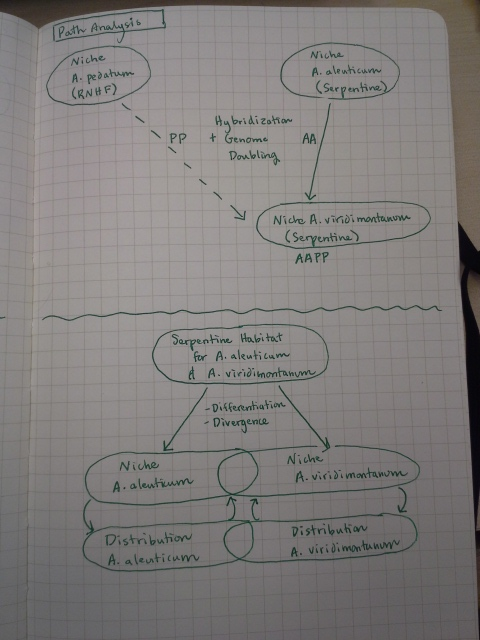
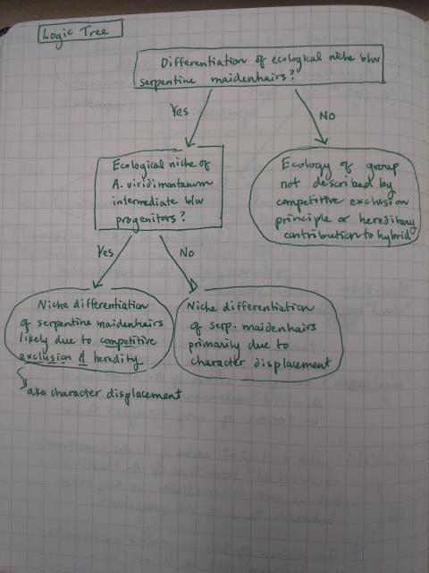
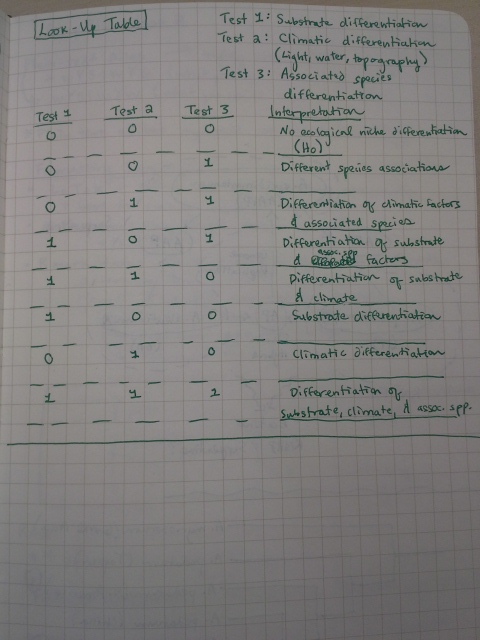
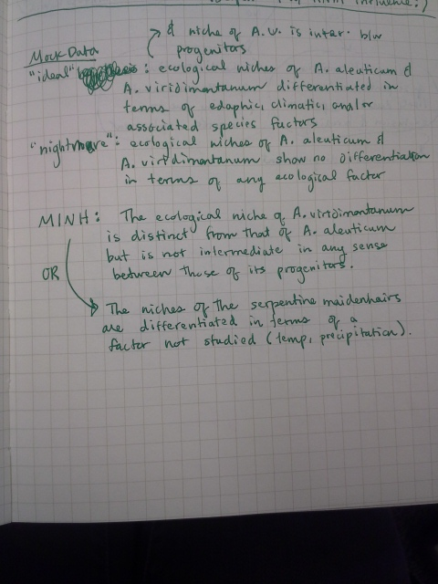

These are the first tools which I used to understand and structure my hypothesis relating to ecological niche differentiation within the *Adiantum pedatum* complex, a clade of maidenhair ferns.    

 

