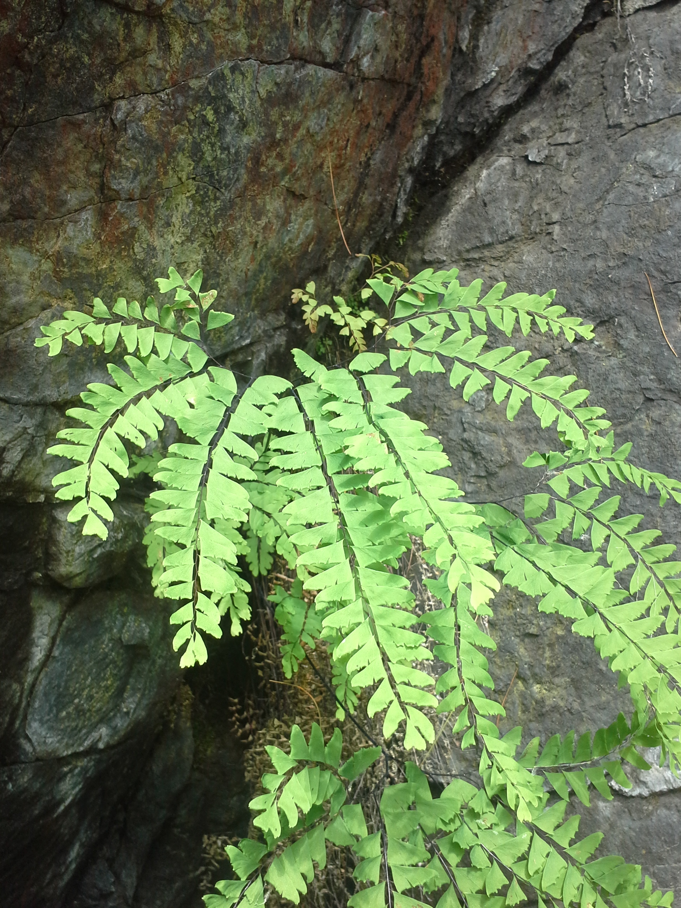

# Morgan Southgate

## Computational Biology

[Link to Barrington Lab Website](http://www.uvm.edu/~dbarring/DSBpeople.html)

Lab assignments: 

* [Homework 1](test.html)   
* [Homework 2](Homework2.html)
* [Homework 3 Part 1- Beech Bark Disease Complex Powerpoint](BBD_Complex.pdf) 
* [Homework 3 Part 2 - Adiantum Logic Tree](Adiantum_LogicTree.html) 
* [Homework 4 Part 1- Adiantum Soil Data](AdiantumSoilAnalysis.html)
* [Homework 4 Part 2]
* [Homework 5]
* [Homework 6](Homework6_Southgate.html)

